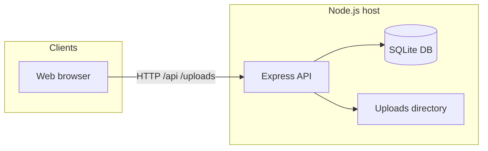

# Architecture

This document explains how Hoverboard is structured for readers adopting the system at a new organization — **no prior knowledge of this codebase is required**.

---

## System architecture overview

- **Single-page application (SPA)** — React + Vite; in development, **Vite dev server** proxies `/api` and `/uploads` to the API process.
- **API** — Express handles REST routes, authentication, file uploads, and business logic.
- **SQLite** — Embedded relational database (file path via **`HOVERBOARD_DB_PATH`**).
- **Uploads** — Spec files and evidence stored on local filesystem paths referenced from DB rows.

Production often places **TLS termination** and **static file hosting** for `client/dist` in front of Node.

---

## Database design (conceptual)

Major entity groups:

| Group | Purpose |
| --- | --- |
| **projects** | Workspaces; **`user_project_roles`** grants access |
| **specs / spec_versions** | Documents and versioned extracted text |
| **drs / vrs / vr_dr_links** | Legacy-first DR/VR model with stable **public_id** |
| **artifacts / artifact_versions** | Graph model for content hashing, approvals, comments |
| **artifact_links** | Trace edges with **`valid` / `suspect`** status |
| **artifact_comments / artifact_approvals** | Collaboration and sign-off |
| **sessions / oauth_states** | Login sessions and OIDC transient state |
| **users / teams / user_global_roles** | Identity and org structure |
| **audit_*** / **audit_log** | Compliance-oriented event history |
| **signoff_rules** | Per-project approval policy |
| **counters** | Monotonic IDs for DR/VR public identifiers |

**Migrations** — Additive schema changes run from **`server/db.js`** at startup (SQLite **`ALTER TABLE`** guards).

---

## Graph model explanation

1. Every DR/VR worth tracing becomes an **`artifacts`** row with **`artifact_type`** and **`external_id`** (matches **`public_id`**).
2. **`artifact_versions`** hold immutable **`content_json`** snapshots.
3. **`artifact_links`** express relationships; **`link_status`** marks **suspect** trace when upstream content changes (see **[artifacts_and_traceability.md](artifacts_and_traceability.md)**).
4. **Legacy sync** fills **`artifact_id`** on **`drs`** / **`vrs`** when missing so older rows participate in the graph.

---

## How traceability works internally

1. **Upload spec vN** → **`spec_versions`** row with extracted text + changelog.
2. **Create DR** → **`drs`** row + **`spec_version_id`** + sync → **artifact A_DR**.
3. **Create VR** + **link** → **`vrs`**, **`vr_dr_links`**, graph links **A_VR → A_DR**.
4. **Upload spec vN+1** → diff; **stale** marks on affected DRs / linked VRs per stale service.
5. **Artifact version bump** on VR → **`markOutgoingLinksSuspect`** may flag downstream edges for review.
6. **Approval** → **`artifact_approvals`** binds approver to **`artifact_version_id`** with **hash**.

---

## RBAC (high level)

- **`middleware/rbac.js`** — Computes effective capabilities from **global roles** and **per-project roles**.
- **`middleware/permissions.js`** — Route guards resolve **`project_id`** from entities (spec, DR, VR, artifact).
- **`X-Project-Id`** header — Client sends active workspace; must align with URL **`/projects/:projectId/...`**.

---

## Traceability to external systems

Regression paths and logs are **pulled** by directory ingest APIs — design agents or CI jobs to drop artifacts where the API can read them, or forward via HTTP.

---

## Related documentation

- **[Artifacts and traceability](artifacts_and_traceability.md)** — User-facing trace concepts.
- **[Installation](installation.md)** — Where DB and uploads live on disk.
